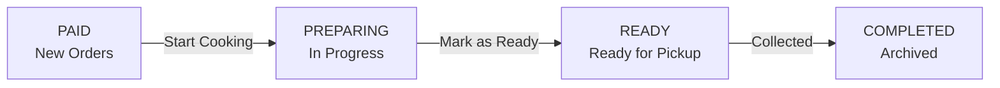

# Mtugo Hotel Staff Dashboard Requirements

## 1. Overview

The Mtugo Hotel Staff Dashboard is a kitchen order management interface that allows authorized hotel staff to monitor paid meal orders, prepare meals, and mark completed orders as ready for customer pickup.

The dashboard uses the following four-status workflow:

**PAID → PREPARING → READY → COMPLETED**

Orders move forward only. Backward transitions are not permitted.

---

## 2. User Story

> As a Mtugo Hotel staff member, I want to see paid-for meals on the dashboard and the approximate pickup time of the customer so that I can prioritize meal preparation and know when orders are expected to be ready.

---

## 3. Dashboard Workflow

### PAID — New Orders

A PAID order is a successfully paid order waiting to be prepared.

**Action:** `Start Cooking`

Transition:

`PAID → PREPARING`

PAID orders are sorted by `order_time`, oldest first.

### PREPARING — In Progress

A PREPARING order is currently being prepared by kitchen staff.

**Action:** `Mark as Ready`

Transition:

`PREPARING → READY`

PREPARING orders are sorted by `paid_at`, oldest first.

### READY — Ready for Pickup

A READY order has finished preparation and is waiting for customer pickup.

**Action:** `Collected`

Transition:

`READY → COMPLETED`

READY orders are sorted by `expected_ready_at`.

### COMPLETED

A COMPLETED order has been collected by the customer and is removed from the active kitchen dashboard.

---

## 4. Forward-Only Transition Rule

| Current Status | Next Status | Allowed |
|---|---|---|
| PAID | PREPARING | Yes |
| PAID | READY | No |
| PAID | COMPLETED | No |
| PREPARING | READY | Yes |
| PREPARING | PAID | No |
| PREPARING | COMPLETED | No |
| READY | COMPLETED | Yes |
| READY | PREPARING | No |
| READY | PAID | No |
| COMPLETED | Previous status | No |

Staff must not be able to move an order backwards.

---

## 5. Three-Column Dashboard

The dashboard shall contain:

1. **New Orders** — PAID
2. **In Progress / Cooking** — PREPARING
3. **Ready for Pickup** — READY

Each order card shall display:

- Order number
- Meal
- Quantity
- Elapsed time
- Expected Ready Time / ETA
- Relevant action button

Example:

```text
┌─────────────────────────────┐
│ #1024                       │
│ Chicken Burger              │
│ Quantity: 2                 │
│ Elapsed: 08 min             │
│ ETA: 12:40 PM               │
│ [ START COOKING ]           │
└─────────────────────────────┘
```

---

## 6. Expected Ready Time (ETA)

### Definition

Expected Ready Time is the estimated time at which an order is expected to be ready for customer pickup.

The ETA is based on the current time and the preparation time of the full queue ahead.

### Calculation

```text
ETA = NOW + SUM(prep_time of all PAID orders)
           + SUM(prep_time of all PREPARING orders)
```

The calculation considers orders currently in both `PAID` and `PREPARING`.

### Operational Meaning

For example:

```text
Current time: 12:00 PM

PAID:
Order #101 → 10 minutes
Order #102 → 15 minutes

PREPARING:
Order #103 → 20 minutes

Total preparation time = 45 minutes

Expected Ready Time = 12:45 PM
```

The ETA must be recalculated when queue or order information changes.

---

## 7. Auto-Refresh

The dashboard shall automatically refresh every **10 seconds**.

The refresh keeps the following information current:

- New orders
- Order status
- Queue position
- ETA
- Ready orders
- Dashboard statistics

The dashboard shall display a **Last Updated** timestamp showing the most recent successful refresh.

Example:

```text
Last Updated: 11:28:30 AM
```

---

## 8. Top Statistics Bar

The dashboard shall show counts for active orders:

```text
New  04        Cooking  02        Ready  03
```

The counts represent:

- PAID orders
- PREPARING orders
- READY orders

The counts update during the 10-second refresh.

---

## 9. Authentication and Security

The `/staff/dashboard` route must be password-protected.

The Staff API must be protected with Basic Authentication.

Unauthorized users must not be able to access or modify staff order information.

---

## 10. API Requirements

Status changes shall use:

```text
PUT /api/staff/orders/{id}/status
```

Required transitions:

```text
PAID → PREPARING
PREPARING → READY
READY → COMPLETED
```

The API must reject invalid and backward status transitions.

---

## 11. Acceptance Criteria

| ID | Acceptance Criteria |
|---|---|
| AC-1 | `/staff/dashboard` is password-protected. |
| AC-2 | PAID orders are sorted by `order_time`, oldest first. |
| AC-3 | PREPARING orders are sorted by `paid_at`, oldest first. |
| AC-4 | READY orders are sorted by `expected_ready_at`. |
| AC-5 | Each card shows order number, meal, elapsed time, ETA, and action button. |
| AC-6 | "Start Cooking" changes PAID → PREPARING using `PUT /api/staff/orders/{id}/status`. |
| AC-7 | "Mark as Ready" changes PREPARING → READY. |
| AC-8 | ETA = NOW + sum of preparation times for all PAID + PREPARING orders. |
| AC-9 | Dashboard automatically refreshes every 10 seconds. |
| AC-10 | Staff API is protected with Basic Authentication. |

---

## 12. Usability Requirements

The dashboard is intended for a busy kitchen environment.

Therefore:

- Buttons must be large and easy to click.
- Text must be large and readable.
- Statuses must be visually obvious.
- Action buttons must have clear labels.
- ETA must be easy to locate.
- The interface should avoid unnecessary elements.
- The layout should remain usable on different screen sizes.

---

## 13. Empty States

When a column contains no orders, display:

```text
No orders
```

---

## 14. Workflow Diagram



Orders may only move forward through the workflow.

---

## 15. Wireframe Requirements

### Low-Fidelity Wireframe

The low-fidelity wireframe shall show the basic dashboard structure without detailed styling.

It must include:

- Header
- Top statistics bar
- Last Updated timestamp
- Three Kanban columns
- Order cards
- Order number
- Meal
- Elapsed time
- ETA
- Action buttons

Save as:

`docs/wireframes/staff-dashboard-lowfi.png`

### High-Fidelity Wireframe

The high-fidelity wireframe shall provide a polished version of the dashboard.

It should include:

- Clear status indicators
- Large readable fonts
- Large touch-friendly buttons
- High-contrast labels
- White order cards
- Clear spacing
- Three equal-width columns
- Prominent ETA
- Top statistics
- Last Updated timestamp

Save as:

`docs/wireframes/staff-dashboard-hifi.png`

---

## 16. Wireframe Structure

```text
┌──────────────────────────────────────────────────────────────────────────────┐
│                              MTUGO HOTEL                                     │
│                                                                              │
│        NEW 04          COOKING 02          READY 03     Last Updated: 11:28  │
└──────────────────────────────────────────────────────────────────────────────┘

┌──────────────────────────┐ ┌──────────────────────────┐ ┌──────────────────────────┐
│      NEW ORDERS (04)     │ │     IN PROGRESS (02)     │ │   READY FOR PICKUP (03)  │
│          PAID            │ │        PREPARING         │ │          READY           │
├──────────────────────────┤ ├──────────────────────────┤ ├──────────────────────────┤
│ ┌──────────────────────┐ │ │ ┌──────────────────────┐ │ │ ┌──────────────────────┐ │
│ │ #1024                │ │ │ │ #1020                │ │ │ │ #1018                │ │
│ │ Chicken Burger       │ │ │ │ Beef Burger           │ │ │ │ Chicken Pizza        │ │
│ │ Quantity: 2          │ │ │ │ Quantity: 1           │ │ │ │ Quantity: 2          │ │
│ │ Elapsed: 05 min      │ │ │ │ Elapsed: 12 min       │ │ │ │ Elapsed: 18 min      │ │
│ │ ETA: 11:40 AM        │ │ │ │ ETA: 11:35 AM         │ │ │ │ ETA: 11:30 AM        │ │
│ │ [ START COOKING ]    │ │ │ │ [ MARK AS READY ]     │ │ │ │ [ COLLECTED ]        │ │
│ └──────────────────────┘ │ │ └──────────────────────┘ │ │ └──────────────────────┘ │
└──────────────────────────┘ └──────────────────────────┘ └──────────────────────────┘
```

---

## 17. Definition of Done

- [ ] Requirements document completed and saved as `docs/staff-requirements.md`.
- [ ] Workflow diagram completed and saved.
- [ ] Workflow clearly shows PAID → PREPARING → READY → COMPLETED.
- [ ] Forward-only transition rules documented.
- [ ] ETA and Expected Ready Time documented.
- [ ] 10-second auto-refresh documented.
- [ ] Low-fidelity wireframe completed.
- [ ] High-fidelity wireframe completed.
- [ ] Wireframes saved under `docs/wireframes/`.
- [ ] Wireframes contain the three required columns.
- [ ] Wireframes contain order number, meal, elapsed time, ETA, and action button.
- [ ] Wireframes contain the top statistics bar.
- [ ] Wireframes contain the Last Updated timestamp.
- [ ] Wireframes use large, readable and touch-friendly controls suitable for a kitchen.
- [ ] All deliverables are committed to the repository.
